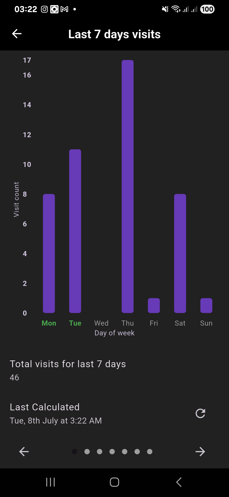
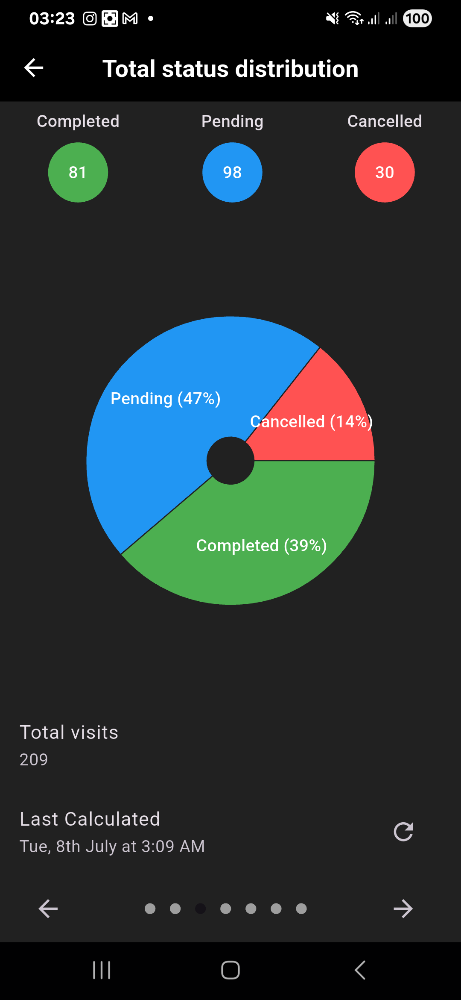

[](https://wakatime.com/badge/user/e508bec6-f1ed-42e9-a365-8c4e69c8dd19/project/cd2034a0-28f1-4885-858e-a6c53b6d69ca)

# sales_rep_visit_tracker_feature

Your task is to build a Visits Tracker feature for a Route-to-Market (RTM) Sales Force
Automation app. Design and structure your solution as though this feature is part of a
larger, scalable application.
The app should allow a sales rep to:

* Add a new visit by filling out a
 Nairobi form ([add_a_new_visit_use_case.dart](lib/domain/use_cases/visit/add_a_new_visit_use_case.dart))
* View a list of their customer
  visits [visit_list_of_past_visits_use_case.dart](lib/domain/use_cases/visit/visit_list_of_past_visits_use_case.dart)
* Track activities completed during the
  visit [visit_list_of_past_visits_use_case.dart](lib/domain/use_cases/visit/visit_list_of_past_visits_use_case.dart)
* View basic statistics related to their visits (e.g., how many
  completed) [count_visit_statistics_use_case.dart](lib/domain/use_cases/visit/count_visit_statistics_use_case.dart)
* Search or filter
  visits [visit_list_of_past_visits_use_case.dart](lib/domain/use_cases/visit/visit_list_of_past_visits_use_case.dart)

# License

This codebase is licensed under
the [Creative Commons Attribution-NonCommercial-NoDerivatives 4.0 International (CC BY-NC-ND 4.0)](https://creativecommons.org/licenses/by-nc-nd/4.0/)
license.

It is provided **strictly for the purpose of evaluation as part of a technical assessment**.

You may:

- View and review the code
- Share it for evaluation purposes

You may **not**:

- Use it for commercial or production purposes
- Modify and distribute it
- Deploy it in real-world systems

For other uses, please contact [**Bruce Omukoko**](https://bruc3balo.github.io)

## Screenshots

<details>
  <summary><strong>Visits</strong></summary>

- **Past Visits**
    - 
    - 

- **Today's Visits**
    - 
    - 

- **Filter Visits**
    - 
    - 

- **Exit Confirmation**
    - 
    - 
</details>

---

<details>
  <summary><strong>Activities</strong></summary>

- **Activity Heat Map**
    - 
    - 

- **Top 5 Activities**
    - 
    - 

- **New Activity**
    - 
    - 

- **Delete/Edit Activity**
    - 
    - 
    - 
    - 
    - 
</details>

---

<details>
  <summary><strong>Customers</strong></summary>

- **Customer Management (Light Mode)**
    - <video src="./docs/images/customer_management_light_mode.mp4" width="25%" controls>Customer Management Light Mode</video>

- **Customers**
    - 
    - 

- **New Customer**
    - 
    - 

- **Top 5 Customers**
    - 
    - 
</details>

---

<details>
  <summary><strong>7-Day Summary</strong></summary>

- **Visits & Status**
    - 
    - 
    - 
    - 

- **Total Status Distribution**
    - 
    - 
</details>


# Dependencies used

1. Dart (3.6.0)
2. Flutter - Stable (3.27.1)
3. json_annotation: ^4.8.1
4. dio: ^5.8.0+1
5. get_it: ^8.0.3
6. hive: ^2.2.3
7. hive_flutter: ^1.1.0
8. crypto: ^3.0.6
9. intl: ^0.18.1
10. badges: ^3.1.2
11. connectivity_plus: ^6.0.3
12. internet_connection_checker: ^1.0.0+1
13. fluttertoast: ^8.2.10
14. fl_chart: ^0.71.0
15. dots_indicator: ^4.0.1
16. flutter_secure_storage: ^9.2.4
17. logger: ^2.6.0
18. flutter_native_splash: ^2.4.4
19. loading_animation_widget: ^1.3.0

# N/B
* Dart code indenture used is **150** **_Each line communicates something_**

# Design pattern

The chosen design pattern is MVVM due to it's robustness and ease of separation of UI and Data layer
The project is divided into 3 layers for clear separation of concerns and code reusability

# Building

## Code generation
```bash
    flutter pub run build_runner build --delete-conflicting-outputs
```

## Environment variables
Store values in a file and pass the path to --dart-define-from-file= or pass them from --dart-define
```properties
SUPABASE_BASE_URL=${SUPABASE_BASE_URL}
SUPABASE_API_KEY=${SUPABASE_API_KEY}
HIVE_ENCRYPTION_KEY_NAME=${HIVE_ENCRYPTION_KEY_NAME}
```

## Running
```bash
    flutter run --dart-define-from-file=.env
```

## Build apk
```bash
    flutter build apk --dart-define-from-file=.env
```

# CI/CD
Tag the commit
```bash
    git tag v.*
```

Push the tag to the remote repo
```bash
    git push origin v.*
```


Splash screen
```bash
  flutter pub run flutter_native_splash:create
```

Icons
```bash
  flutter pub run flutter_launcher_icons
```


